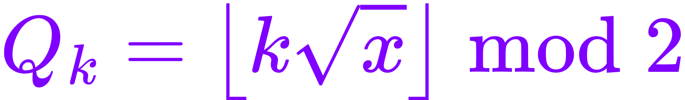

# Billiard Fractals

## [Full article](https://github.com/xcontcom/billiard-fractals/blob/main/docs/article.md)

This project explores how simple rules - like a billiard ball bouncing in a rectangular grid - can produce complex, structured patterns when translated into symbolic sequences.

By reducing 2D trajectories to 1D symbolic sequences:

we uncover recursive, quasi-fractal structures emerging purely from irrational steps and modular thresholds. These binary sequences, when rendered spatially, exhibit self-similarity, despite being entirely deterministic.

Further extending this idea with nonlinear functions:

we observe patterns resembling **interference textures** or **symbolic holography** - generated not by waves, but by curved discretization.

The work presented here is a translation and adaptation of my articles on Habr ([Part 1](https://habr.com/en/articles/194406/), [Part 2](https://habr.com/en/articles/441516/), [Part 3](https://habr.com/en/articles/447326/), [Part 4](https://habr.com/en/articles/595433/))

## [Full article](https://github.com/xcontcom/billiard-fractals/blob/main/docs/article.md)
