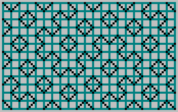
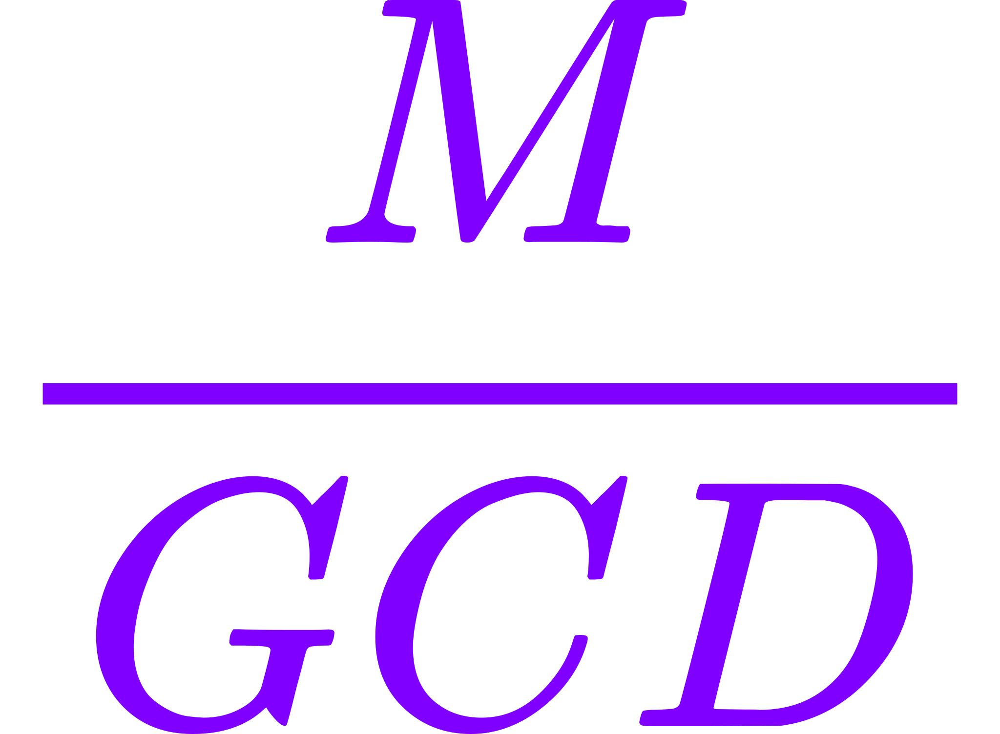
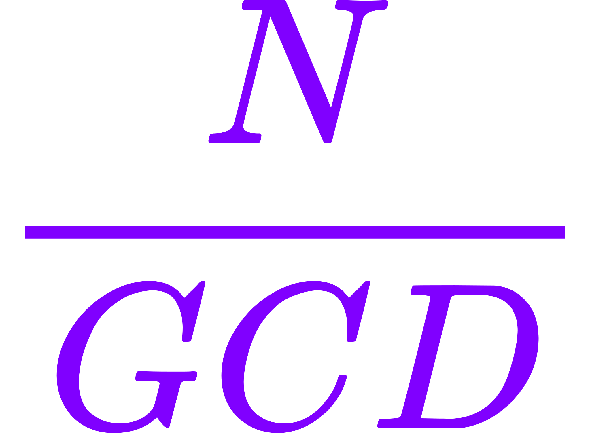
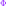
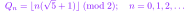

# The Billiard Fractals

Complex systems often appear chaotic or incomprehensible, yet closer examination reveals that such complexity can frequently be reduced to a simple underlying mechanism. By systematically removing layers of emergent behavior, one can uncover a fundamental rule or equation from which the entire system originates.


While the system described in this article may appear trivial at first glance, the resulting patterns exhibit quasi-fractal behavior that can be analyzed, encoded, and even predicted through symbolic methods. The work presented here was developed independently through direct observation, rather than derived from prior literature.

A useful way to motivate this exploration is by analogy with a common physical phenomenon - wave interference. Consider waves on the surface of a river: a wavefront moves toward the shore, reflects, and overlaps with itself. Do these reflections contain an underlying order? Is it possible to extract structure from the interference?

To investigate this, we simplify the system. Rather than modeling the full wave, we consider only the motion vector - essentially, a ray. We also smooth the “shoreline” and discretize the environment into a rectangular grid. From this setup emerges the core construction of this article.

<details><summary>:)</summary>

---

The example of waves on the surface of a river serves as a real, intuitive starting point - an accessible physical system that demonstrates how simple rules, such as reflection and interference, can produce complex behavior. It illustrates the central idea: that what appears chaotic often emerges from deterministic structure.

The initial motivation was driven by the conviction that apparent disorder is not randomness, but the result of unresolved or hidden structure. Any system that seems chaotic is governed by rules - its complexity a consequence of perspective, not unpredictability.

To explore this further, attention turned to constructing the simplest possible system that could look chaotic yet remain fully deterministic.

One such system involved a sine wave originating from the corner of a rectangle and reflecting off its boundaries. The nonlinearity of the sine function causes it to intersect itself in complex and unintuitive ways. However, due to limited tools available at the time, the model was simplified even further.

Instead of a sine wave, a straight line was used. The line was made periodic (dashed), and the system was designed to be reproducible using only a pencil and a sheet of graph paper. Despite its simplicity, this construction revealed intricate and structured patterns-forming the foundation of what would later be described as the “billiard fractals.”

---

</details>

## Visualizing the Billiard Algorithm

The following sequence illustrates the core mechanism of the discrete billiard system:


An animated version:


Output pattern:


A selection of patterns generated from rectangles with various dimensions:

| | | | |
|---|---|---|---|
|  |  |  |  |
|  |  |  |  |
|  |  |  |  |

[JavaScript implementation of this algorithm](https://xcont.com/pattern.html)  
[`pattern.js`](https://github.com/xcontcom/billiard-fractals/blob/main/js/pattern.js) - source code

---

## Fibonacci Numbers and Pattern Refinement

The patterns generated by this system exhibit fractal structure: they are self-similar across scales, recursive in construction, and can be compressed symbolically. As the rectangle dimensions increase following the Fibonacci sequence, the patterns reveal increasingly detailed versions of the same underlying structure.

This refinement process is simple: given rectangle dimensions `(m, n)`, new dimensions are generated by Fibonacci summation. For example, starting with 8×13:

- 13 + 8 → 21 → becomes 13×21
- Then 21 + 13 → 34 → becomes 21×34, and so on

Each step increases resolution while preserving the underlying structure.

| 8×13 | 13×21 | 21×34 | 34×55 | 55×89 |
|------|-------|--------|--------|--------|
|  |  |  |  |  |

<details><summary>233×377 preview comparison</summary>

---  

The article’s header image corresponds to the 233×377 pattern. Its structure can be directly compared with the earlier 13×21 case.  

---

</details>

When constructing these patterns using Fibonacci-based dimensions, we are effectively approximating a rectangle with side lengths in the golden ratio - that is, a ratio approaching (1 : φ). With each step, the approximation improves, and the pattern gains additional structure and resolution.

Although the overall structure of the pattern remains consistent during Fibonacci-based refinement, certain symmetries within the pattern depend on the parity of the rectangle's side lengths. Specifically, when both the width and height are odd integers, the resulting pattern exhibits clear diagonal, horizontal, and vertical symmetry. This occurs because the billiard path, under these conditions, terminates in the corner diagonally opposite from its starting point. In contrast, when one or both sides are even, the path terminates elsewhere, and the resulting pattern loses this precise symmetry - although the underlying recursive structure remains unchanged.

---

## Boundary Analysis and Recursive Symmetry

To understand why the structure persists under Fibonacci expansion, consider cutting a square from the pattern. The boundary behavior reveals that the path (i.e., the “billiard ball”) always returns to its entry point:


Moreover, the path always (except for diagonal cases) crosses an even number of cells. This ensures that the pattern remains consistent across such subdivisions.


By recursively separating square regions from the larger pattern, the symbolic seed of the system can be exposed:


---

## Binary Representation and Symbolic Extraction

The path traced by the billiard ball through the grid can be encoded as a binary sequence. As the ball moves from cell to cell, its internal state alternates according to a fixed rule. We can label these alternating states with binary values - for example, assigning 0 to one state and 1 to the other. This produces a binary field that can be visualized directly.

For example:

  


The top row of the binary field can be viewed as a symbolic boundary - a compact representation of the billiard system's behavior along a single edge. By studying the structure of the full 2D pattern and recursively extracting square sections from it, we arrive at symbolic generation rules. These rules allow us to reconstruct the boundary sequences using only binary operations.

Two core recursive generators are presented below:

```js
function invers(array) {
	var temp = [];
	for (let i = 0; i < array.length; i++)
		temp[i] = array[i] === 0 ? 1 : 0;
	return temp;
}

function revers(array, s) {
	var temp = [];
	for (let i = 0; i < s; i++)
		temp[i] = array[array.length - i - 1];
	return temp;
}

function seqence(fn, fn1) {
	if (fn1 === 3) return [1];
	fn1 = fn - fn1;
	fn = fn - fn1;
	var array = seqence(fn, fn1);
	var a0 = invers(array);
	var a1 = (fn1 % 2 === 0) ? [1] : [];
	var a2 = revers(array, Math.floor((fn - fn1) / 2));
	return a0.concat(a1, a2);
}

function seqenceFibonacci(iterations) {
	let f0a = [0];
	let f1a = [0];
	for (let i = 0; i < iterations; i++) {
		let f0 = f0a.length;
		let a2 = revers(f1a, f0);
		if (f1a.length % 2 === 0) a2[0] ^= 1;
		f0a = f1a;
		f1a = f1a.concat(a2);
	}
	let array = [];
	for (let i = 0; i < Math.floor(f1a.length / 2); i++)
		array[i] = f1a[i * 2];
	return array;
}
```

These constructions reproduce the symbolic edges of Fibonacci-based patterns and can be interpreted as recursive encoding schemes derived directly from the observed geometry.

<details><summary>Toward Generalization</summary>

---

While the above generators are constructed specifically for Fibonacci-sized rectangles, preliminary experiments suggest that similar structures may emerge for other co-prime pairs. These systems may obey different symbolic transformation rules, but exhibit comparable recursive or compressible traits. A formal generalization of these behaviors remains an open area of exploration.

---

</details>

One of the central challenges that motivated the progression from the original 2013 construction to the deeper analysis in 2019 was the question of irrational proportions: what happens when the rectangle’s side lengths form a truly irrational ratio, such as (1 : φ), rather than an integer-based approximation like 13 : 21?

While recursive generators such as `seqence(fn, fn1)` accurately reproduced the symbolic boundary sequences for Fibonacci-based rectangles, they were inherently tied to integer dimensions. The challenge was clear: how can one generate the same structures when no exact grid alignment is possible - when the trajectory no longer closes?

This question defines the next stage of the investigation. To answer it, we will analyze the boundary sequences themselves - the so-called *fractal sequences* - and show how they encode the entire 2D pattern. We will show that these sequences - far from being edge artifacts - contain enough information to deterministically reconstruct the entire 2D pattern. This finding enables a powerful dimensional reduction: the entire billiard system can be expressed as a 1D sequence.

---

## Binary Billiards

We now shift from the dashed-line visualization to a binary representation. Instead of drawing the trajectory, we color the cells the ball passes through, alternating black (0) and white (1) with each step.

Given a rectangle with side lengths  and , the ball is launched from a corner and follows diagonal motion, reflecting off the walls. Each step alternates the internal binary state.




The reflection rule causes the pattern to shift by one cell after each bounce. This alternation creates a consistent visual structure.


When  and  are coprime, the trajectory visits every cell exactly once:


[JavaScript implementation](https://xcont.com/binarypattern/)  
[`binarypattern.js`](https://github.com/xcontcom/billiard-fractals/blob/main/js/binnarypattern.js)

If the dimensions share a common divisor ( 1$">), the trajectory terminates at a corner before filling all cells:


In this case, the system is equivalent to a billiard in a reduced rectangle with dimensions (, ):


---

### Boundary Behavior and Symmetry

In the coprime case, the ball crosses every row and column. Notably, each pass between the top and left walls consists of an **even** number of steps.

  


From this, we can observe a critical symmetry: the **left column** contains the inverted bits of the **top row**, excluding the initial bit.


Furthermore, every second bit () in the top sequence is the inverted version of its neighbor (). Therefore, we can discard every second bit and retain full pattern information:


For example, with dimensions , the resulting sequence is: 1010010110

This sequence is **unique** for every coprime pair . It encodes all necessary information about the pattern.

---

### Sequence Interpretation

The trajectory between two reflections from the upper wall is always  cells long. Each such pass begins with a black cell (bit = 0) and ends with a white cell (bit = 1):


More formally:  
- A bit of `1` indicates that the ball arrived from a reflection off the **right wall**
- A bit of `0` indicates it came from the **left wall**

This mapping gives the sequence its meaning. In the diagram below, the trajectory is colored black when moving right and white when moving left:


---

### Reconstruction from the Sequence

The full billiard pattern can be reconstructed from this single boundary sequence. Even extrapolation beyond the grid is possible.

Let us begin by placing the bits along the top edge of a square grid of width . Bits are spaced every 2 cells — these are the points where the ball would hit the upper wall:


Then:
- If the bit is `1`, we extend a diagonal to the **left**
- If the bit is `0`, we extend it to the **right**


The first bit (bit 0) is treated specially — it begins the pattern:


The reconstruction produces the exact original pattern:

  


[JavaScript implementation](https://xcont.com/binarypattern/visualizer/)  
[`visualizer.js`](https://github.com/xcontcom/billiard-fractals/blob/main/js/visualizer.js)

---

This result shows that the 1D sequence contains **complete information** about the original 2D billiard pattern.

But we're not done.

From the surface of the river, we reduced the system to a rectangular billiard with a dashed diagonal trajectory. Then we reduced it further — to a binary field generated by alternating internal states. Now, we push the reduction one step further: we collapse the entire 2D billiard into a one-dimensional rule. A symbolic system with no geometry left — only structure.

This is where we begin to uncover the origin of these fractals.

---

## One-dimensional billiards

On the  number axis, we take two points:  and .


Moving from one point to another, we measure the distances :


We marked a point. We continue to measure the distance from this point, maintaining the direction. If we reach point  or , we change the direction:


As you can see in the pictures above, the first point shows the place where the ball touches the bottom wall of the billiard table. We are not interested in this point. We will only mark the points  for .

How to mark these points? Let's unfold our billiard table on the  axis. Let's mark the points . Now, having reached point , we do not change the direction of movement, but continue moving to point .


Points that are multiples of  divide our axis into segments. We will conditionally mark these segments with ones and zeros (alternating). On the segments marked with zeros, the ball (in rectangular billiards) moves from left to right. On the segments marked with ones, it moves from right to left. Or more simply: the ball moves from left to right if , for


It is easy to see that the point at which the ball touched the upper wall of the billiard table is the remainder of dividing  by . In this case, we don't need to record the movement of the ball in the opposite direction. We take the integer part of dividing  by , if it is even — we calculate the remainder of dividing  by . We divide the resulting remainder by 2 (the distance between adjacent touch points is two cells). This gives us the indices of the array elements that correspond to rightward motion (zeros). All other entries - representing leftward trajectories - are filled with ones.

Sequence length = .

```js
function sequence(m,n){
	var md=m/2;
	var array=[];
	for(var k=0;k<md;k++) array[k]=1;
	for(var k=0;k<md;k++) if(Math.floor(2*k*n/m)%2==0) array[((2*k*n)%m)/2]=0;
	return array;
}
```

Now we can build a binary sequence for billiards with any sides  and  (natural numbers). Some examples:
144x89 (Fibonacci numbers):
010100101101001011010110100101101001010010110101001011010100101

169x70 (Pell numbers):
010101101010010101101010010101101010100101011010101001010110101001010101010010101101010010

233x55 (odd Fibonacci numbers  and ):
010010011011011001001101101100100100110110010010011011001001001101101100100110110110010010011011001001001101100100100

<details><summary>This is dope</summary>

---

Very curious graphs are obtained if you take a billiard table with width  and construct sequences for each  from  to . Then these sequences are stacked.

```js
	var array;
	for(var y=1;y<m;y++){
		array=sequence(m,y);
		for(var x=0;x<array.length;x++){
			if(array[x]==0) context.fillRect (x, y, 1, 1);
		}
	}
```

Some examples.

| M=610 | M=611 | M=612 | M=613 | M=614 |
|------|-------|--------|--------|--------|
|  |  |  |  |  |

[JavaScript implementation](http://xcont.com/binarypattern/sequences/)  
[`sequences.js`](https://github.com/xcontcom/billiard-fractals/blob/main/js/sequences.js)

---

</details>

We have sequences. How else can we visualize binary sequences? With Turtle graphics.

---

### Turtle graphics

The sequence length determines the complexity of the curve. The more irrational the ratio between M and N, the more non-periodic and fractal - like the structure becomes.

Draw a segment. Then take bits from our sequence one by one. If bit = 1 - rotate the segment relative to the previous one by  (clockwise). If bit = 0 - rotate the segment by . The beginning of the next segment is the end of the previous one.


Take two large enough Fibonacci numbers:  and . This ensures that the pattern is long enough for the fractal structure to become apparent, but still bounded enough for visualization.

We built the sequence:
0010110100101101001010010110100101101010010110100101101001010010110100101… (257114 symbols plus a zero bit).

Visualize using turtle graphics. The size of the initial segment is 1 pixels (the initial segment is in the lower right corner):


The next example is Pell numbers.
1 \end{cases}$">

We take  and .

The sequence is:
00101001010110101001010101010100101011010100101010110101001010101101 (235415 symbols plus a zero bit).

The size of the initial segment is 1 pixel:


Another example is the odd Fibonacci numbers  and .
Let's take  and .
The sequence is:
00110110010010011011001001101101100100110110110010011011011001001… (158905 plus a zero bit).
Instead of the angles  and , we will use the angles  and .
The size of the initial segment is 1 pixels:


This curve is called "[Fibonacci Word Fractal](https://en.wikipedia.org/wiki/Fibonacci_word_fractal)". The Hausdorff dimension for this curve is known:


[JavaScript implementation](https://xcont.com/binarypattern/turtle/)  
[`turtle.js`](https://github.com/xcontcom/billiard-fractals/blob/main/js/turtle.js)

---

### The problem unsolved yet.

Is it possible to draw a pattern for billiards, the sides of which are incommensurable (one of the sides is an irrational number)? At first glance, the task seems impossible. Trying to solve this problem, we will face a number of questions:

1. If the sides are incommensurable, we cannot tile the billiards with cells of the same size.
2. If the sides are incommensurable, the ball will infinitely reflect and will never get into the corner.
3. Sequences in billiards are not filled in order, but chaotically.


The first two questions obviously have no solution. But if there were a way to fill the sequence in order, then we could, moving along the sequence from left to right, restore the pattern in the way we used above. And thus see what the pattern looks like in the upper left corner of the billiard table whose sides are incommensurable.

---

### o_O

Let's take a billiard table, the sides of which are equal to the Fibonacci numbers (this trick may not work with other numbers). Let's throw a ball into it and record the number of times the ball touches the upper wall. We'll paint the numbers white if the ball moved from right to left and black if the ball moved from left to right:


White corresponds to the number one in the sequence, black to zero. Now let's arrange the numbers in order:


We've got exactly the same sequence of ones and zeros.

21(1), 13(0), 8(1), 26(0), 5(0), 16(1), 18(0), 3(1), 24(1), 10(0), 11(1), 23(0), 2(0), 19(1), 15(0), 6(1), 27(1), 7(0), 14(1), 20(0), 1(1), 22(1), 12(0), 9(1), 25(0), 4(0), 17(1)

1(1), 2(0), 3(1), 4(0), 5(0), 6(1), 7(0), 8(1), 9(1), 10(0), 11(1), 12(0), 13(0), 14(1), 15(0), 16(1), 17(1), 18(0), 19(1), 20(0), 21(1), 22(1), 23(0), 24(1), 25(0), 26(0), 27(1)


<details><summary>For other numbers</summary>

---

The origin is the upper left corner. The  axis is the width of the billiard table . The  axis is the height of the billiard table . The numbers for which the sequences match are marked with white dots:


Numbers for which the sequence is inverted:


JavaScript implementation:


The first line is the mouse coordinates, which are used as the width and height of the billiard table.
The second line is the first 100 bits of the sequence obtained through the remainders of the division.
The third line is the first 100 bits of the sequence obtained through the parity of the integer part.

Black color - Visualization of the first sequence using Turtle graphics.
Purple - visualization of the second sequence.

[JavaScript implementation](http://xcont.com/binarypattern/mouseturtle/)  
[`turtle_dynamic.js`](https://github.com/xcontcom/billiard-fractals/blob/main/js/turtle_dynamic.js)

---

</details>

In fact, in some cases, we do not need to take the remainder from the division. For Fibonacci numbers, it is enough to check the parity of the integer part of the division of  by :


In the numerator we have . In the denominator - .

As is known:


This gives us a bridge: rational billiards (, ) converge toward an irrational limit -  - allowing us to define an infinite symbolic sequence.

 is the Golden Ratio. An irrational number. Now we can write our formula as:


We have obtained a formula with which we can fill in the sequence for a billiard table, the width of which is  and the height is . The length of the sequence = , but we can restore part of the pattern by moving from left to right along the sequence and looking into the upper left corner of the billiard table. It remains to figure out how to calculate 

One divided by the golden ratio can be rewritten as:


We can get rid of the two:


Our formula takes the form:


Now we can draw part of the billiard pattern with sides  and :


If we do not subtract  each time, then every second bit in the sequence is inverted. We get the general formula:

:

Let's build a sequence for $k\sqrt{2}$

```js
var x=2;
var q=[];
for(var k=0;k<256000;k++) q[k]=Math.floor(k*Math.sqrt(x))%2;
```

The first few bits of the sequence ([A083035](http://oeis.org/A083035)):
01001101100100110011001101100100110110011001001101100100110110…

Angles are  and . The size of the initial segment is 5 pixels:


<details><summary>This is interesting</summary>

---

From this curve, we can reconstruct the "billiard pattern" and see what is around the curve:


It would be interesting to choose  and  for this pattern.

---

</details>

<details><summary>And this</summary>

---

Number of segments in the repeating part of the curve =  (Pell numbers: 0, 1, 2, 5, 12, 29, 70, 169, 408, 985, 2378, … ).


---

</details>

Someone may doubt that the parity of the integer part of  gives a fractal sequence. Let's visualize part of this sequence with the visualizer described earlier:


For clarity, I colored the longest curve in the resulting pattern:


This curve has a name - "Fibonacci word fractal".

Thus, by gradually reducing billiard geometry through symbolic encodings, we arrive at a powerful realization: even irrational systems, which defy spatial tiling and corner reflection, can still produce deterministic, fractal structure — using only integer math.

---

## Filling the Fractal: From Symbolic Structure to Visual Density

In the previous sections, we showed how symbolic sequences can generate complex boundary structures in discrete 2D space. All of these patterns - whether generated by rational billiards or floor-based symbolic systems - form enclosed regions.
Some of these regions close against the boundaries of the rectangle, while others are fully self-contained, looping within the grid. In either case, the resulting trajectories always define fully enclosed cells.

Consider the following example:

A binary sequence generated by the floor function:


0100110110010011001001101100

Using [the visualizer](https://xcont.com/binarypattern/visualizer/) in diagonal mode, we generate a familiar fractal boundary.


However, switching to horizontal–vertical visualization, we invert every even-indexed bit and plot dashed lines accordingly. For bits with value 0, the lines are offset by one unit.

Vertical lines:


Horizontal lines:


Merged:


This technique resembles **Hitomezashi stitching**, a traditional Japanese method of generating textile patterns. While historically used to create decorative designs, this form of boundary generation bears striking similarity to the symbolic outlines produced in our system.

However, **Hitomezashi does not solve the filling problem**. It provides only the **skeleton** — the structure of edges — but no mechanism for interior construction.


---

## A Symbolic Filling Algorithm

To solve this, we developed a symbolic method to **automatically fill** the interior regions — using only the original sequence. No region detection, no geometry, no search algorithms.

The method works as follows:

Construct a cumulative array a[n], based on the bitwise value of the fractal sequence:


In code:

```js
var a = [0];
for (var i = 1; i < size; i++) {
	if (Math.floor(i * Math.sqrt(2)) % 2 == 1)
		a[i] = a[i - 1] + 1;
	else
		a[i] = a[i - 1] - 1;
}
```

Then, for each cell (x, y), compute:

```js
q = (a[x] + a[y] + 512) % 4;
if (q === 0 || q === 1)
	context.fillRect(x, y, 1, 1);
```

The result is a filled pattern — not derived from pixel analysis or region marking, but **emerging directly from the same symbolic system** that generated the boundaries.

### Full Algorithm

```js
var a=[0];
for(var i=1;i<size;i++){
	if(Math.floor(i*Math.sqrt(2))%2==1)
		a[i]=a[i-1]+1;
	else
		a[i]=a[i-1]-1;
}
for(var x=0;x<size;x++){
	for(var y=0;y<size;y++){
		q=(a[x]+a[y]+512)%4;
		if(q==0 || q==1) context.fillRect(x, y, 1, 1);
	}
}
```

## Examples

Fractal fill based on:




(Fibonacci-based)


### Interactive

[Visualizer — Fractal Fill from Irrationals](https://xcont.com/binarypattern/fractal.html)  
[`fractal.js`](https://github.com/xcontcom/billiard-fractals/blob/main/js/fractal.js)

[Dynamic Visualization — Using Rational Approximations](https://xcont.com/binarypattern/fractal_dynamic.html)  
[`fractal_dynamic.js`](https://github.com/xcontcom/billiard-fractals/blob/main/js/fractal_dynamic.js)

---

