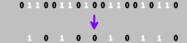
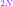
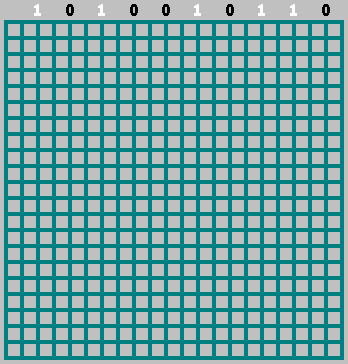

# The Billiard Fractals

Complex systems often appear chaotic or incomprehensible, yet closer examination reveals that such complexity can frequently be reduced to a simple underlying mechanism. By systematically removing layers of emergent behavior, one can uncover a fundamental rule or equation from which the entire system originates.


While the system described in this article may appear trivial at first glance, the resulting patterns exhibit quasi-fractal behavior that can be analyzed, encoded, and even predicted through symbolic methods. The work presented here was developed independently through direct observation, rather than derived from prior literature.

A useful way to motivate this exploration is by analogy with a common physical phenomenon - wave interference. Consider waves on the surface of a river: a wavefront moves toward the shore, reflects, and overlaps with itself. Do these reflections contain an underlying order? Is it possible to extract structure from the interference?

To investigate this, we simplify the system. Rather than modeling the full wave, we consider only the motion vector - essentially, a ray. We also smooth the “shoreline” and discretize the environment into a rectangular grid. From this setup emerges the core construction of this article.

<details><summary>:)</summary>

---

The example of waves on the surface of a river serves as a real, intuitive starting point - an accessible physical system that demonstrates how simple rules, such as reflection and interference, can produce complex behavior. It illustrates the central idea: that what appears chaotic often emerges from deterministic structure.

The initial motivation was driven by the conviction that apparent disorder is not randomness, but the result of unresolved or hidden structure. Any system that seems chaotic is governed by rules - its complexity a consequence of perspective, not unpredictability.

To explore this further, attention turned to constructing the simplest possible system that could look chaotic yet remain fully deterministic.

One such system involved a sine wave originating from the corner of a rectangle and reflecting off its boundaries. The nonlinearity of the sine function causes it to intersect itself in complex and unintuitive ways. However, due to limited tools available at the time, the model was simplified even further.

Instead of a sine wave, a straight line was used. The line was made periodic (dashed), and the system was designed to be reproducible using only a pencil and a sheet of graph paper. Despite its simplicity, this construction revealed intricate and structured patterns-forming the foundation of what would later be described as the “billiard fractals.”

---

</details>

## Visualizing the Billiard Algorithm

The following sequence illustrates the core mechanism of the discrete billiard system:


An animated version:


Output pattern:


A selection of patterns generated from rectangles with various dimensions:

| | | | |
|---|---|---|---|
|  |  |  |  |
|  |  |  |  |
|  |  |  |  |

[JavaScript implementation of this algorithm](https://xcont.com/pattern.html)  
[`pattern.js`](https://github.com/xcontcom/billiard-fractals/blob/main/js/pattern.js) - source code

---

## Fibonacci Numbers and Pattern Refinement

The patterns generated by this system exhibit fractal structure: they are self-similar across scales, recursive in construction, and can be compressed symbolically. As the rectangle dimensions increase following the Fibonacci sequence, the patterns reveal increasingly detailed versions of the same underlying structure.

This refinement process is simple: given rectangle dimensions `(m, n)`, new dimensions are generated by Fibonacci summation. For example, starting with 8×13:

- 13 + 8 → 21 → becomes 13×21
- Then 21 + 13 → 34 → becomes 21×34, and so on

Each step increases resolution while preserving the underlying structure.

| 8×13 | 13×21 | 21×34 | 34×55 | 55×89 |
|------|-------|--------|--------|--------|
|  |  |  |  |  |

<details><summary>233×377 preview comparison</summary>

---  

The article’s header image corresponds to the 233×377 pattern. Its structure can be directly compared with the earlier 13×21 case.  

---

</details>

When constructing these patterns using Fibonacci-based dimensions, we are effectively approximating a rectangle with side lengths in the golden ratio - that is, a ratio approaching (1 : φ). With each step, the approximation improves, and the pattern gains additional structure and resolution.

Although the overall structure of the pattern remains consistent during Fibonacci-based refinement, certain symmetries within the pattern depend on the parity of the rectangle's side lengths. Specifically, when both the width and height are odd integers, the resulting pattern exhibits clear diagonal, horizontal, and vertical symmetry. This occurs because the billiard path, under these conditions, terminates in the corner diagonally opposite from its starting point. In contrast, when one or both sides are even, the path terminates elsewhere, and the resulting pattern loses this precise symmetry - although the underlying recursive structure remains unchanged.

---

## Boundary Analysis and Recursive Symmetry

To understand why the structure persists under Fibonacci expansion, consider cutting a square from the pattern. The boundary behavior reveals that the path (i.e., the “billiard ball”) always returns to its entry point:


Moreover, the path always (except for diagonal cases) crosses an even number of cells. This ensures that the pattern remains consistent across such subdivisions.


By recursively separating square regions from the larger pattern, the symbolic seed of the system can be exposed:


---

## Binary Representation and Symbolic Extraction

The path traced by the billiard ball through the grid can be encoded as a binary sequence. As the ball moves from cell to cell, its internal state alternates according to a fixed rule. We can label these alternating states with binary values - for example, assigning 0 to one state and 1 to the other. This produces a binary field that can be visualized directly.

For example:

  


The top row of the binary field can be viewed as a symbolic boundary - a compact representation of the billiard system's behavior along a single edge. By studying the structure of the full 2D pattern and recursively extracting square sections from it, we arrive at symbolic generation rules. These rules allow us to reconstruct the boundary sequences using only binary operations.

Two core recursive generators are presented below:

```js
function invers(array) {
	var temp = [];
	for (let i = 0; i < array.length; i++)
		temp[i] = array[i] === 0 ? 1 : 0;
	return temp;
}

function revers(array, s) {
	var temp = [];
	for (let i = 0; i < s; i++)
		temp[i] = array[array.length - i - 1];
	return temp;
}

function seqence(fn, fn1) {
	if (fn1 === 3) return [1];
	fn1 = fn - fn1;
	fn = fn - fn1;
	var array = seqence(fn, fn1);
	var a0 = invers(array);
	var a1 = (fn1 % 2 === 0) ? [1] : [];
	var a2 = revers(array, Math.floor((fn - fn1) / 2));
	return a0.concat(a1, a2);
}

function seqenceFibonacci(iterations) {
	let f0a = [0];
	let f1a = [0];
	for (let i = 0; i < iterations; i++) {
		let f0 = f0a.length;
		let a2 = revers(f1a, f0);
		if (f1a.length % 2 === 0) a2[0] ^= 1;
		f0a = f1a;
		f1a = f1a.concat(a2);
	}
	let array = [];
	for (let i = 0; i < Math.floor(f1a.length / 2); i++)
		array[i] = f1a[i * 2];
	return array;
}
```

These constructions reproduce the symbolic edges of Fibonacci-based patterns and can be interpreted as recursive encoding schemes derived directly from the observed geometry.

<details><summary>Toward Generalization</summary>

---

While the above generators are constructed specifically for Fibonacci-sized rectangles, preliminary experiments suggest that similar structures may emerge for other co-prime pairs. These systems may obey different symbolic transformation rules, but exhibit comparable recursive or compressible traits. A formal generalization of these behaviors remains an open area of exploration.

---

</details>

One of the central challenges that motivated the progression from the original 2013 construction to the deeper analysis in 2019 was the question of irrational proportions: what happens when the rectangle’s side lengths form a truly irrational ratio, such as (1 : φ), rather than an integer-based approximation like 13 : 21?

While recursive generators such as `seqence(fn, fn1)` accurately reproduced the symbolic boundary sequences for Fibonacci-based rectangles, they were inherently tied to integer dimensions. The challenge was clear: how can one generate the same structures when no exact grid alignment is possible - when the trajectory no longer closes?

This question defines the next stage of the investigation. To answer it, we will analyze the boundary sequences themselves - the so-called *fractal sequences* - and show how they encode the entire 2D pattern. We will show that these sequences - far from being edge artifacts - contain enough information to deterministically reconstruct the entire 2D pattern. This finding enables a powerful dimensional reduction: the entire billiard system can be expressed as a 1D sequence.

---

## Binary Billiards

We now shift from the dashed-line visualization to a binary representation. Instead of drawing the trajectory, we color the cells the ball passes through, alternating black (0) and white (1) with each step.

Given a rectangle with side lengths  and , the ball is launched from a corner and follows diagonal motion, reflecting off the walls. Each step alternates the internal binary state.


The reflection rule causes the pattern to shift by one cell after each bounce. This alternation creates a consistent visual structure.


When  and  are coprime, the trajectory visits every cell exactly once:


[JavaScript implementation](https://xcont.com/binarypattern/)  
[`binarypattern.js`](https://github.com/xcontcom/billiard-fractals/blob/main/js/binnarypattern.js)

If the dimensions share a common divisor ( 1$">), the trajectory terminates at a corner before filling all cells:


In this case, the system is equivalent to a billiard in a reduced rectangle with dimensions (, ):


---

### Boundary Behavior and Symmetry

In the coprime case, the ball crosses every row and column. Notably, each pass between the top and left walls consists of an **even** number of steps.

  


From this, we can observe a critical symmetry: the **left column** contains the inverted bits of the **top row**, excluding the initial bit.


Furthermore, every second bit () in the top sequence is the inverted version of its neighbor (). Therefore, we can discard every second bit and retain full pattern information:



For example, with dimensions , the resulting sequence is: 1010010110

This sequence is **unique** for every coprime pair . It encodes all necessary information about the pattern.

---

### Sequence Interpretation

The trajectory between two reflections from the upper wall is always  cells long. Each such pass begins with a black cell (bit = 0) and ends with a white cell (bit = 1):


More formally:  
- A bit of `1` indicates that the ball arrived from a reflection off the **right wall**
- A bit of `0` indicates it came from the **left wall**

This mapping gives the sequence its meaning. In the diagram below, the trajectory is colored black when moving right and white when moving left:


---

### Reconstruction from the Sequence

The full billiard pattern can be reconstructed from this single boundary sequence. Even extrapolation beyond the grid is possible.

Let us begin by placing the bits along the top edge of a square grid of width . Bits are spaced every 2 cells — these are the points where the ball would hit the upper wall:



Then:
- If the bit is `1`, we extend a diagonal to the **left**
- If the bit is `0`, we extend it to the **right**


The first bit (bit 0) is treated specially — it begins the pattern:


The reconstruction produces the exact original pattern:

  


[JavaScript implementation](https://xcont.com/binarypattern/visualizer/)  
[`visualizer.js`](https://github.com/xcontcom/billiard-fractals/blob/main/js/visualizer.js)

---

This result shows that the 1D sequence contains **complete information** about the original 2D billiard pattern.

But we're not done.

From the surface of the river, we reduced the system to a rectangular billiard with a dashed diagonal trajectory. Then we reduced it further — to a binary field generated by alternating internal states. Now, we push the reduction one step further: we collapse the entire 2D billiard into a one-dimensional rule. A symbolic system with no geometry left — only structure.

This is where we begin to uncover the origin of these fractals.

---

## One-dimensional billiards


